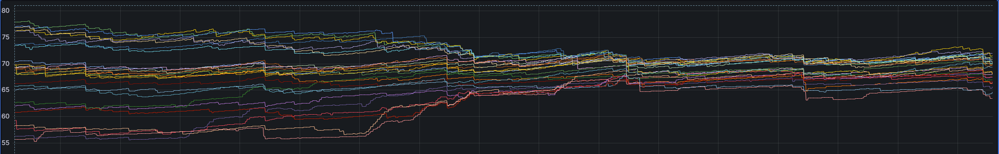

# Elasticsearch Rebalancer

This repo is a fork of the original [elasticsearch-rebalance](https://github.com/EDITD/elasticsearch-rebalancer) project. The original project not include some features that we need, for example use the shard_id instead of the index name for the shard algoritms or skip the rebalance between nodes with the same attributes.

## What is it?
A script that attempts to re-balance Elasticsearch shards by size without changing the existing balancing.

By default ES balances shards over nodes by considering:

+ The number of shards / node
+ The number of shards / index / node

Which is great if every shard is the same size, but in reality this is not the case. Without considering the size of shards (except for watermarks) it's possible to end up with some nodes almost at watermark alongside others that are almost empty. 
This diagram highlights the problem `elasticsearch-rebalance` attempts to solve:




## How does it work?

The script is based around the idea of "swaps" - pairs of shards to relocate between the two nodes. Each iteration the script identifies the most-full and least-full nodes, searching through their largest/smallest shards to find a suitable swap. Ideally the `largest shard on the most-full node` and the `smallest shard on the least-full node` swap.

To maintain existing ES balances, shards are only considered if the node to move to does not have any other shard from the same index. This means the shards per node and shards per index per node remain the same, so ES shouldn't do any additional rebalancing.

## Usage


All option in nex section can be passed as environment variables with the prefix `ES_REBALANCE_` and the option in uppercase. For example, `--es-user` can be passed as `ES_REBALANCE_ES_USER`.

To avoid the manual installation of the package, you can build a docker using the Dockerfile provided in the repository. 


Actual supporto options are (`es-rebalance --help`):
```
Usage: es-rebalance [OPTIONS] ES_HOST

Options:
  --es-user TEXT                  Elasticsearch user.
  --es-password TEXT              Elasticsearch password.
  --iterations INTEGER            Number of iterations (swaps) to execute.
  --attr TEXT                     Rebalance only on node with attributes
                                  specified here. Attributes is accepted in
                                  format key=value.
  --commit                        Execute the shard reroutes (default print
                                  only).
  --print-state                   Print the current nodes & weights and exit.
  --index-name TEXT               Filter the indices for swaps by name,
                                  supports wildcards.
  --max-node TEXT                 Force the max node to consider for shard
                                  swaps.
  --min-node TEXT                 Force the min node to consider for shard
                                  swaps.
  --one-way                       Disables shard swaps and simply moves max ->
                                  min. Note after ES rebalancing is restored
                                  ES will attempt to rebalance itself
                                  according to it's own heuristics.
  --override-watermarks           Temporarily override the Elasticsearch low &
                                  high disk watermark settings. Makes it
                                  possible to parallel swap shards even when
                                  the most full nodes are on the limit.
  --use-shard-id                  If passed, we use an internal unique
                                  shard_id instead index name for shard
                                  algoritms. Without this params if index of
                                  shard is in the max and min node, shard will
                                  be skipped. To be used when indices have
                                  shards and you want to rebalance shards
                                  between nodes.
  --skip-attr TEXT                If specified we avoid rebalance beetween
                                  node that have same attributes specified
                                  here. Attributes are in string format and
                                  separated by space. Example: --skip-attr
                                  rack_id key_1 key_2
  --max-shard-size INTEGER        Max shard size in bytes. If a shard is
                                  larger than this, it will be skipped.
  --node-role TEXT                Filter the nodes for swaps by role.
                                  Typically this are the roles defined in the
                                  elasticsearch.yml file. Generally you can
                                  use this "hot" or "warm" or "cold" to filter
                                  nodes by their role.Default is "data", which
                                  means all data are considered for rebalance.
  --max-recovery-per-node INTEGER
                                  Max number of concurrent recoveries per
                                  node. If a node has more recoveries, it will
                                  be skipped.
  --infinite-loop                 Run the rebalance in infinite loop.
  --min-diff INTEGER              Min difference in bytes between nodes to
                                  consider rebalance.
  --disable-rebalance             Set cluster.routing.rebalance.enable to none
                                  before rebalance and restore after.
                                  Generally should be passed and will be used
                                  only if --commit is passed.
  --timeout INTEGER               Timeout in seconds for Elasticsearch
                                  requests and cluster health check.
  --help                          Show this message and exit.
```

